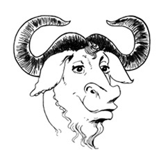

# 
Github与TortoiseGit练习

这是一份Markdown格式的文档。

 *倾斜* 

**加粗** 

[链接](https://github.com/ibyte2011/gitTest)
 
- 无序列表 条目1
- 无序列表 条目2
- 无序列表 条目3

分割线

----------

## 二级标题 ##

### 三级标题 ###

#### 四级标题 ####

##### 五级标题  #####

有序列表：

1. 有序列表 条目1
1. 有序列表 条目2
1. 有序列表 条目3
1. 有序列表 条目4
	1
图片：

An [example][id]. Then, anywhere
else in the doc, define the link: [id]

[id]: http://example.com/  "Title" [d]

[d]: "dni"

&copy;

<html>

    
    This is an image

Hi !

#container {
    height:100px;
    line-height:100px;
}

#container img {
    vertical-align:middle;
    max-height:100%;
}
</html>

